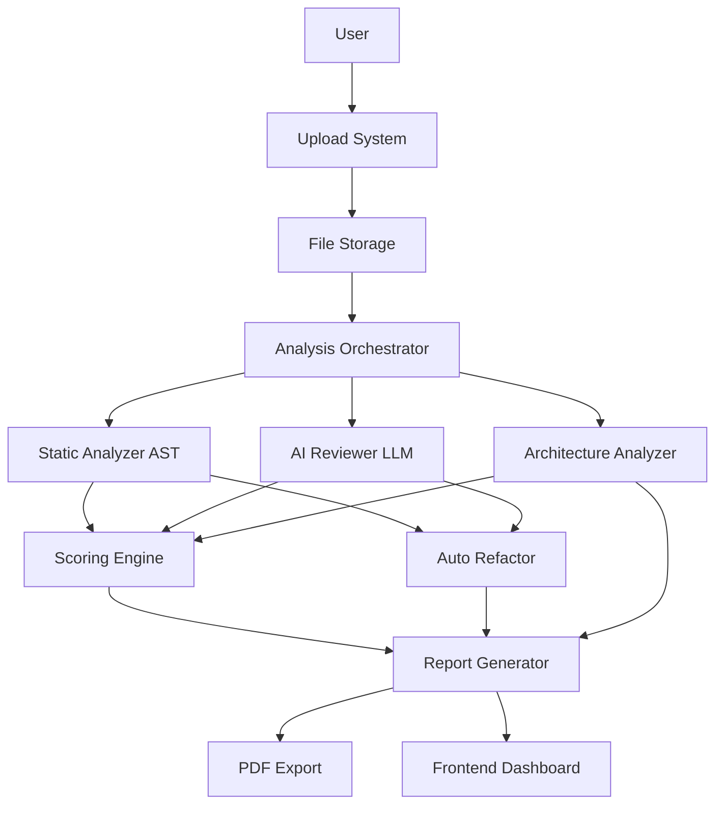

# AI-Based Code Quality Auditor & Architecture Reviewer

> A professional-grade code analysis platform that combines **Static Analysis (AST)** + **AI Reasoning (LLMs)** to audit entire codebases like a senior software engineer.


## 🎯 What Makes This Unique

Unlike simple linters or AI chatbots, this platform:

✅ **Understands entire codebases** using hybrid AST + AI analysis  
✅ **Professional chunking strategy** (500-1500 lines) like GitHub Copilot & ChatGPT Code Interpreter  
✅ **Generates real fixes** with before/after code comparisons  
✅ **Produces architecture diagrams** to visualize code structure  
✅ **Calculates developer scores** (0-100) across multiple dimensions  
✅ **Generates professional audit reports** in PDF format  

## 🏗 Architecture



## 🔥 Features

### 1. Code Quality Issues
- Long functions (>50 lines)
- Deeply nested logic
- Bad variable naming
- Unused code
- Wrong patterns
- Circular dependencies
- Missing error handling

### 2. Security Issues
- Hardcoded secrets
- Unsafe patterns
- Missing validation
- User input vulnerabilities

### 3. Performance Issues
- Inefficient loops
- Unnecessary re-renders
- Expensive operations
- Poor data structures

### 4. Architecture Issues
- Wrong folder structure
- SOLID principle violations
- God objects
- Tight coupling
- Missing abstraction layers

### 5. Auto Refactoring
- Before vs after code comparison
- AI-generated improvements
- Syntax validation
- Diff visualization

## 🛠 Tech Stack

**Backend (`server/`)**
- Node.js + Express.js
- MongoDB (Mongoose)
- Google Gemini API (2.0 Flash)
- Multer (file uploads)
- Puppeteer (PDF generation)

**Analysis Engine (`analysis/`)**
- @babel/parser (JavaScript/TypeScript)
- ESComplex (complexity metrics)
- Custom dependency graph builder

**Frontend (`client/`)**
- Next.js 16 + React 19
- Tailwind CSS 4
- Recharts (score visualizations)
- Mermaid (architecture diagrams)
- React Diff Viewer (code comparisons)

## 🚀 Getting Started

### Prerequisites
- Node.js 18+ 
- MongoDB (local or Atlas)
- Google Gemini API Key

### Installation

1. **Clone the repository**
```bash
git clone <repo-url>
cd CodeAnalyzer
```

2. **Setup Backend**
```bash
cd server
npm install
cp .env.example .env
# Edit .env and add your GEMINI_API_KEY and MONGODB_URI
```

3. **Setup Analysis Engine**
```bash
cd ../analysis
npm install
```

4. **Setup Frontend**
```bash
cd ../client
npm install
```

### Running the Application

1. **Start MongoDB** (if running locally)
```bash
mongod
```

2. **Start Backend Server**
```bash
cd server
npm run dev
```
Server runs on http://localhost:5000

3. **Start Frontend**
```bash
cd client
npm run dev
```
Frontend runs on http://localhost:3000

## 📊 How It Works

### Step 1: Upload Codebase
- Upload ZIP file
- Paste GitHub URL
- Upload single files

### Step 2: Chunking Strategy (Industry Standard)
```javascript
// Large file (3000 lines) → Split into chunks
file.js (3000 lines) → 
  chunk1 (lines 1-500) +
  chunk2 (lines 451-950) [50 line overlap] +
  chunk3 (lines 901-1400) + ...
```

### Step 3: Parallel Analysis
- **Static Analysis**: AST parsing for code smells
- **AI Review**: Gemini API for design/architecture issues
- **Architecture**: Dependency graph generation

### Step 4: Result Merging
- Deduplicate issues in overlap regions
- Merge findings from all chunks
- Calculate weighted scores

### Step 5: Generate Report
- Group issues by severity
- Show before/after refactored code
- Display architecture diagrams
- Calculate Developer Score (0-100)
- Export as PDF

## 📈 Scoring Formula

```
DeveloperScore = (
  40% × Static Analysis Score +
  40% × AI Review Score +
  20% × Architecture Score
)
```

**Category Scores:**
- Maintainability (function size, complexity)
- Readability (naming, comments)
- Security (vulnerabilities)
- Architecture (SOLID, coupling)
- Performance (efficiency)

## 🎯 Use Cases

- **Code Reviews**: Automated pre-review analysis
- **Refactoring**: Identify improvement opportunities
- **Learning**: Understand code quality principles
- **Auditing**: Generate compliance reports
- **Team Standards**: Enforce coding guidelines

## 📁 Project Structure

```
CodeAnalyzer/
├── client/          # Next.js frontend
│   ├── src/
│   │   ├── app/           # Pages
│   │   ├── components/    # React components
│   │   └── lib/           # Utilities
│   └── package.json
├── server/          # Express backend
│   ├── controllers/ # Route handlers
│   ├── models/      # MongoDB schemas
│   ├── routes/      # API routes
│   ├── utils/       # Helper functions
│   └── index.js     # Entry point
└── analysis/        # Static analysis engine
    ├── parsers/     # AST parsers
    ├── rules/       # Analysis rules
    ├── runner/      # Orchestrator
    └── utils/       # Shared utilities
```

## 🔒 File Upload Limits

- **Maximum file size**: 250MB
- **Maximum total codebase**: 1GB
- **GitHub repos**: Shallow clone (depth 1)

## 🌐 API Endpoints

### Projects
- `GET /api/projects` - List all projects
- `GET /api/projects/:id` - Get project details
- `DELETE /api/projects/:id` - Delete project

### Upload
- `POST /api/upload/file` - Upload single file
- `POST /api/upload/zip` - Upload ZIP
- `POST /api/upload/github` - Clone GitHub repo

### Analysis
- `POST /api/analyze/:projectId` - Trigger analysis
- `GET /api/projects/:id/issues` - Get all issues
- `GET /api/projects/:id/scores` - Get scores

### Reports
- `GET /api/projects/:id/report/pdf` - Download PDF
- `GET /api/projects/:id/report/json` - Download JSON

## 🤝 Contributing

Contributions are welcome! Please feel free to submit a Pull Request.

## 📄 License

ISC

## 🙏 Acknowledgments

Inspired by:
- GitHub Copilot
- ChatGPT Code Interpreter
- Sourcegraph Cody
- SonarQube
- DeepSource

---

**Built with ❤️ using AI + Static Analysis**
# CodeReviewer
# CodeReviewer
# CodeReviewer
